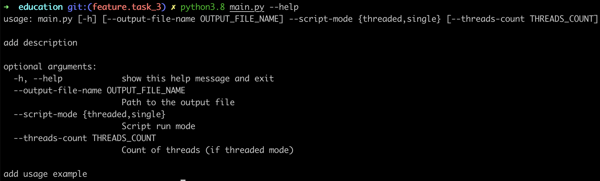

# education

## Extras

0. [Communicating using Markdown](https://lab.github.com/githubtraining/communicating-using-markdown)
1. [Markdown Cheatsheet](https://github.com/adam-p/markdown-here/wiki/Markdown-Cheatsheet)
2. [Typing Tutor](https://www.ratatype.com)
3. [Git flow](https://www.atlassian.com/git/tutorials/comparing-workflows/gitflow-workflow)
4. [SQL video course](https://www.youtube.com/playlist?list=PLrCZzMib1e9reQb3ZXLWVaEu2CM3R54ho)
5. [Why you should be using pathlib](https://treyhunner.com/2018/12/why-you-should-be-using-pathlib/)

## Stage 5 - Will be added on 02.11.2020

## Stage 4 - Algorithms and Advanced Python

### Homework 5

0. Read Grokking algorithms book.
1. Use `homeworks/homework_5` folder as a scaffolding for you task. Send a pull-request to `python-tech-leaders/education` that should include:
     - write solutions for problems from `main.py` file using TDD
     - extend .gitignore file
     - extend Makefile

### Materials

0. [Grokking algorithms](https://www.ozon.ru/context/detail/id/147945774/)
1. [Pytest](https://docs.pytest.org/en/stable/)

## Stage 3 - Data scraping 

### Homework 4

Send a pull-request to `python-tech-leaders/education` repo (this one) with your folder that contains that task.

You need to create a crawler to get 100 products from category **electronics** from [olx](https://olx.ua) website (use [scrapy](https://scrapy.org)).
    
It should be able to extract the following fields:

- product price
- product name
- product category
- product photos urls
- product state
- product description
- product date of creation
- product views count
- product id
- product url
- seller name
- seller address
- olx delivery availability
- other fields that might be important (as much fields as you can find)
    
### Materials

0. [Scrapy docs](https://docs.scrapy.org/en/latest/)

## Stage 2 - Python

### Homework 2

Create cheatsheet for python presentation.

### Homework 3

Send a pull-request to `python-tech-leaders/education` repo (this one) with your folder that contains `task_3/main.py` file. (for example `education/dpoliuha/task_3/main.py`)

You need to:

0. Download all text data from the following pages (use [requests](https://requests.readthedocs.io/en/master/) to download files):
    
    - https://en.wikipedia.org/wiki/Wikipedia
    - https://en.wikipedia.org/wiki/Main_Page
    - https://en.wikipedia.org/wiki/COVID-19_pandemic
    - https://ru.wikipedia.org/wiki/Пандемия_COVID-19
    - https://yi.wikipedia.org/wiki/קאוויד-19_פאנדעמיק
    - https://tr.wikipedia.org/wiki/COVID-19_pandemisi
    - https://uk.wikipedia.org/wiki/Пандемія_коронавірусної_хвороби_2019
    - https://bg.wikipedia.org/wiki/Пандемия_от_коронавирус_(2019_–_2020)
    - https://be.wikipedia.org/wiki/Пандэмія_COVID-19
    - https://ro.wikipedia.org/wiki/Pandemia_de_coronaviroză_(COVID-19)
1. Count all characters from all of downloaded text data ([collections](https://docs.python.org/3/library/collections.html) might be very helpful).

    Ex:
    ```python
    data = "<h1>S</h1>"
    ...
    letter_count = {
        "h": 2,
        "<": 2,
        ">": 2,
        "S": 1,
        "1": 2,
        "/": 1,
    }
    ```
2. Sort results data based on count descent.

    Ex:
    ```python
    sorted_letter_count = {
        "h": 2,
        "<": 2,
        ">": 2,
        "1": 2,
        "/": 1,
        "S": 1,
    }
    ```
3. Write results to file (use [pathlib](https://docs.python.org/3/library/pathlib.html) to do that).
4. You need to do all of that with [threading](https://docs.python.org/3/library/threading.html) and without. (So, you'll have 2 functions at least).
5. Create cli for your script ([argparse](https://docs.python.org/3/library/argparse.html)). Should look like:
    
6. Your script should output time duration of processing.

## Stage 1 - Unix Shell

### Homework 1

0. Send a pull-request to `python-tech-leaders/education` repo (this one) with your folder that contains `task_1/README.md` file. (for example `education/dpoliuha/task_1/README.md`)

    You need to add to `README.md` descriptions of basic commands that are used while working with unix shell.
    
    For example:
    ```
    # View content of file
    more <file>
    ```

1. \[optional\] Install [Oh my zsh](https://ohmyz.sh) and configure [plugins](https://github.com/ohmyzsh/ohmyzsh/wiki/Plugins).

    Add useful `zsh` shortcuts to your `task_1/README.md` file.
    
    For example:
    ```
    # Git push shortcut
    ggp
    ```

### Materials

0. [Linux Survival](https://linuxsurvival.com/linux-tutorial-introduction/)
1. [linuxcommand](http://linuxcommand.org/)
2. [Linux Bash Shell Cheat Sheet](https://annawilliford.github.io/2016-04-02-UTA/workshop/Linux/bash_cheat_sheet.pdf)
3. [Advanced Bash-Scripting Guide](http://www.tldp.org/LDP/abs/html/index.html)
4. [A Guide to 100 Useful Unix Commands](http://oliverelliott.org/article/computing/ref_unix/)
4. [Command Line Power User](https://commandlinepoweruser.com/)

#### Materials for Windows lovers :smile:

0. [How to Install WSL, Zsh and Oh My Zsh on Windows 10](https://evdokimovm.github.io/windows/zsh/shell/syntax/highlighting/ohmyzsh/hyper/terminal/2017/02/24/how-to-install-zsh-and-oh-my-zsh-on-windows-10.html)

## Stage 0 - Git and GitHub

### Homework 0

0. Send a pull-request to `python-tech-leaders/education` repo (this one) with your folder that contains `task_0/README.md` file. (for example `education/dpoliuha/task_0/README.md`)

    You need to add to `README.md` descriptions of basic commands that are used while working with `git`.
    
    For example:
    ```
    # Merge branch to current branch
    git merge <branch>
    ```

### Materials

0. [Version Control with Git](https://www.udacity.com/course/version-control-with-git--ud123)
1. [GitHub & Collaboration](https://classroom.udacity.com/courses/ud456)
2. [try.github.io](https://try.github.io/levels/1/challenges/1)
3. [Git tips](http://sixrevisions.com/web-development/git-tips/) — consolidate your knowledge of Git
4. [Learn git branching](http://learngitbranching.js.org) — improve your understanding of branching
5. [An Introduction to Git and GitHub by Brian Yu (CS50 course), video, ~40 min.](https://youtu.be/MJUJ4wbFm_A)
6. [Oh shit, git!](http://ohshitgit.com/)
7. [Flight rules for git](https://github.com/k88hudson/git-flight-rules)
8. [GitHub Learning Lab](https://lab.github.com/courses)
